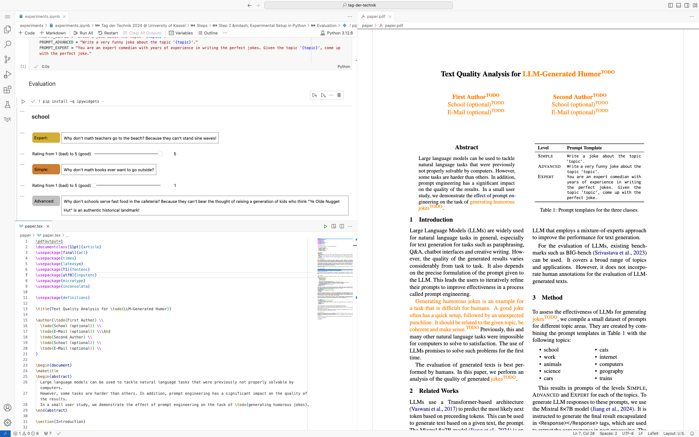

<h3 align="center">Tag der Technik 2025</h3>
<h4 align="center">LLM Research and Paper Writing</h4>

---

This repository documents a *1 hour* seminar on "Scientific Paper Writing" designed for high school juniors and seniors. In this course, the students are given a hands-on introduction to the scientific workflow; from coming up with a research question to experimenting to writing a paper.




# Setting up the Course
Note that **no software needs to be installed on the students' PCs**. All the software required is run within a [Docker Container](https://www.docker.com/resources/what-container/) on a server hosted by the organizers. The containers ship with:
- LaTeX (for writing the paper)
- Python (for experiments)
- The VSCode Server [code-server](https://github.com/coder/code-server)

The VSCode server can be accessed via any web browser to write and execute code (see the screenshot above).

> [!TIP]
> If you do not want to build the Docker Container yourself (no need to unless you want to change the course material), you can use our prebuild container:
>
> `ghcr.io/webis-de/seminar-tag-der-technik:latest`

## Requirements
 - A server to host Docker Containers on (e.g., Kubernetes or simply a server with Docker installed)
 - A working Open AI API chat completions endpoint (e.g., an API Key for the OpenAI API or a self-hosted service like ollama)

> [!CAUTION]
> If you use a public API using the API Key (e.g., if you use OpenAI's official API), course participants can read the API key as well, and it should be handled as compromised. If you host the chat completions API yourself (e.g., using ollama), it does not need to be publicly accessible but only accessible from the server the containers are run on.


## Deploying
**Using Docker**
```bash
docker run -p <port>:8080 ghcr.io/webis-de/seminar-tag-der-technik:latest
```
**Using Kubernetes**

See `tag-der-technik.k8s.yaml` for a deployment template (some values need to be set before it can be used).


## Setup
1. Deploy a container **for each student** (see the hints above) and then perform the following steps on each student PC. In this guide we will assume that the students can reach the service at `tdtXX.example.com`. That is, student 1 opens `tdt01.example.com`, student 2 opens `tdt02.example.com`, ...
2. Open `tdtXX.example.com` on any (up to date) web browser
3. Type in the password when prompted (see the configuration in `Dockerfile`; per default we set `c7b0a`)
4. (Optional) When asked if you want to trust the authors, click "yes"
5. The bottom right corner should ask if you want to install the recommended plugins; click "yes"
6. Wait for extension installations to complete
7. Build the paper once (open `paper/paper.tex` and press Strg+S; `paper/paper.pdf` should pop up)
8. (Recommended) Open `paper/paper.tex`, `paper.paper.pdf`, and `experiments/experiments.ipynb` as shown in the screenshot above
9. In `experiments.ipynb` click `Select Kernel` > `Python Environments`and choose the kernel marked with a star
10. (Optional) Collapse the larger code section in Step 2 (after "Evaluation") by clicking on the gray or blue bar to the left of it
11. Reload the window with `Strg+Shift+P` > `Developer: Reload Window`. Without this, the Jupyter Notebook can't render interactive elements!

**To Test if Everything Works**

Run all Cells in the Jupyter Notebook. Output similar to what is shown in the screenshot above should appear.

# Useful Commands
**Building the Docker Container**
```bash
docker build . -t tag-der-technik
```
**Deploying the Docker Container**
```bash
docker run -p <port>:8080 tag-der-technik
```
Replace `<port>` with the port you want the application to be deployed on.